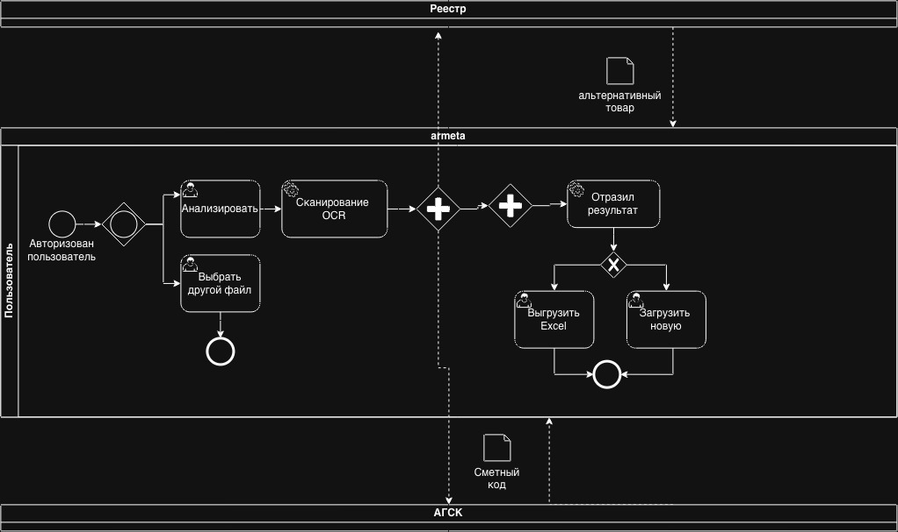
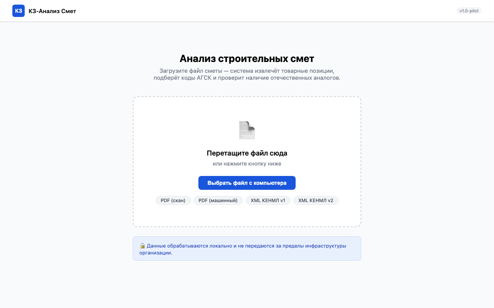
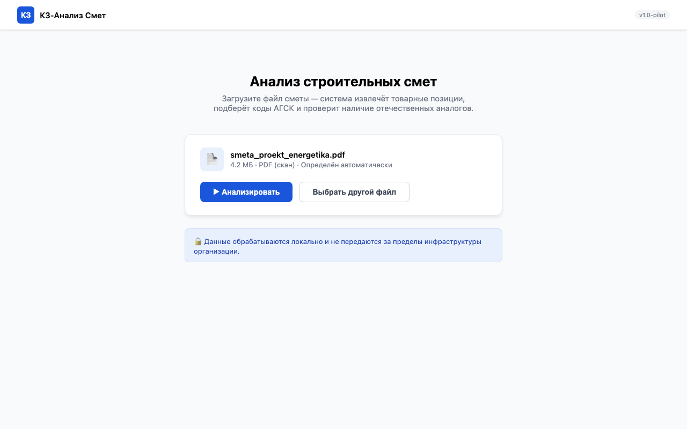
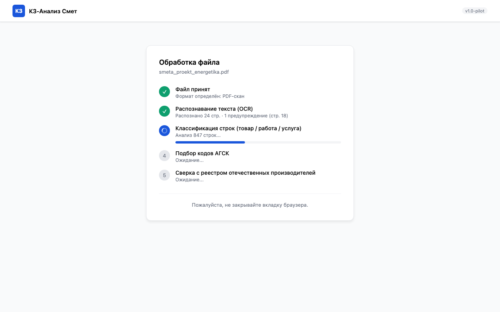
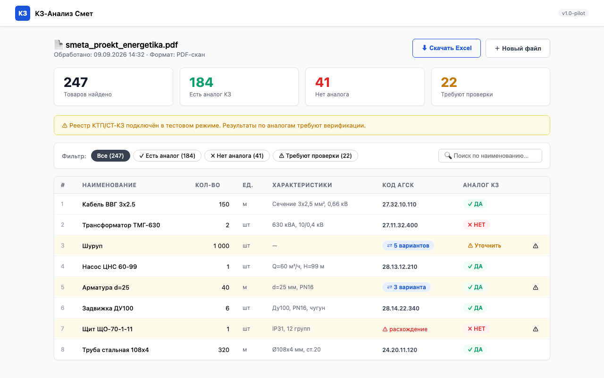
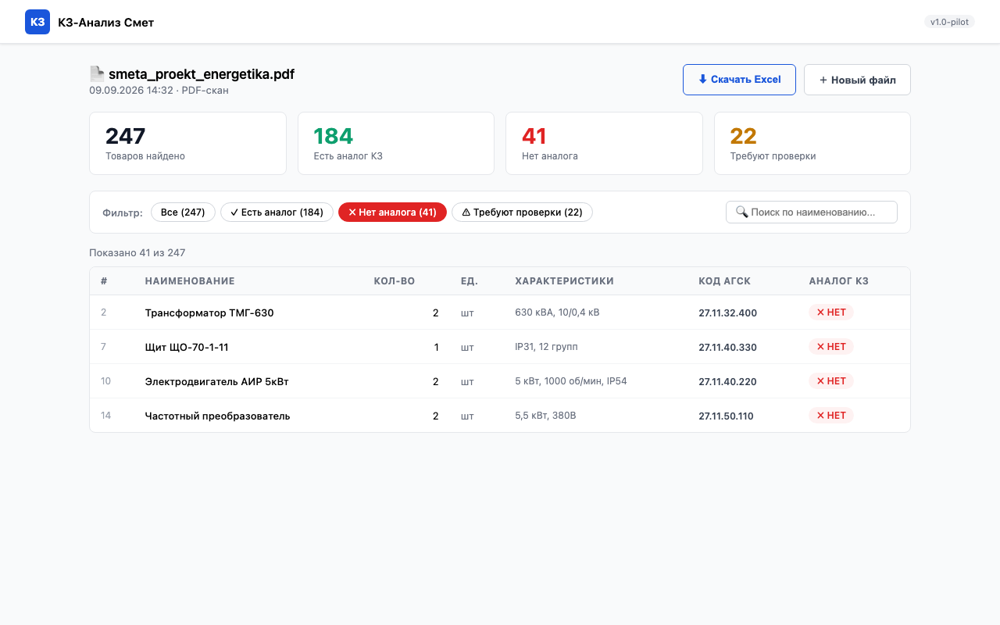
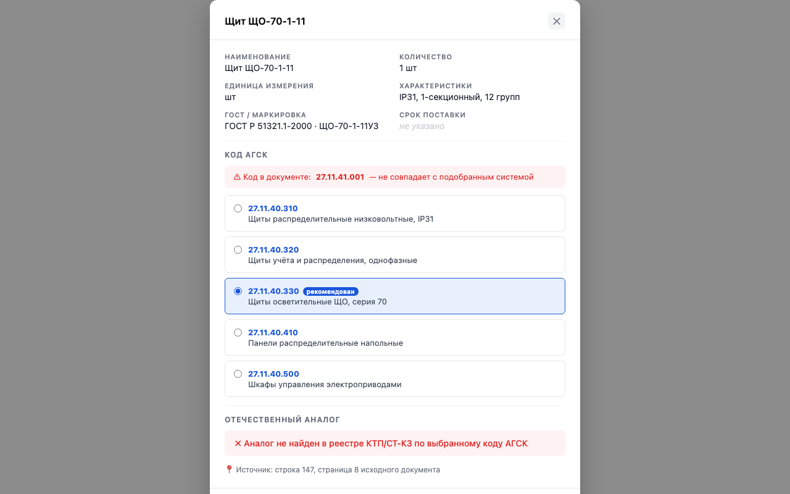
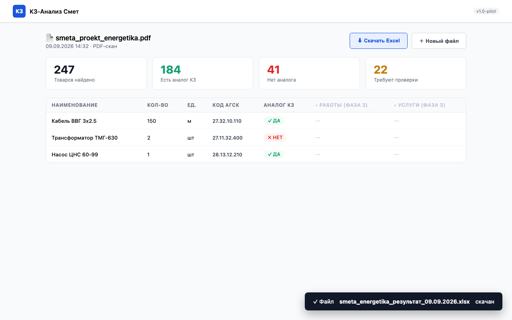
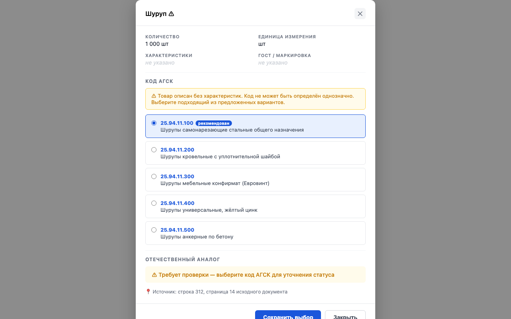

# Техническое задание — КЗ-Анализ Смет
**Версия:** 1.0-pilot · **Дата:** 09.09.2026 · **Статус:** В разработке

> Сервис автоматизированного анализа строительных смет на предмет местного содержания.
> Принимает файл сметы → извлекает товарные позиции → подбирает коды АГСК → проверяет наличие отечественного аналога в реестре КТП/СТ-КЗ.

---

## 1. Акторы

| Роль | Описание |
|---|---|
| **Пользователь** | Единственный актор системы в пилоте. Нетехнический специалист-сметчик. |

---

## 2. TO-BE процесс (BPMN)

Диаграмма описывает целевой процесс анализа сметы — от загрузки файла до получения отчёта. Три плавательные дорожки: **Пользователь**, **АГСК**, **Реестр КТП/СТ-КЗ**.

---

## 3. Форматы входных данных

| Формат | Описание | Обработка |
|---|---|---|
| **КЕНМЛ** (XML) | Сметы в формате XML (v1 и v2). Версия определяется автоматически. | Парсинг XML, фильтрация служебных узлов |
| **PDF (цифровой)** | Выгрузка из АВС. Текст доступен напрямую. | Парсинг текстового слоя |
| **PDF (скан)** | Старые сметы, отсканированные с подписями. Текста нет — только изображение. OCR может путать единицы измерения («тонна» → «тысяча»). Строки с низкой уверенностью помечаются флагом на ручную проверку. | OCR → сверка единиц со словарём → нормализация |

---

## 4. Функциональные требования

| ID | Требование | Приоритет |
|---|---|---|
| FR-01 | Приём файла через веб-форму (drag & drop + кнопка). Автоопределение формата. | Must |
| FR-02 | Парсинг КЕНМЛ v1 и v2. Извлечение ресурсных узлов типа «материал / оборудование». | Must |
| FR-03 | OCR и парсинг PDF-скана. При уверенности ниже порога — флаг строки. | Must |
| FR-04 | Классификация каждой строки сметы: `товар / работа / услуга`. В пилоте анализируются только товары. | Must |
| FR-05 | Карточка товара: наименование, кол-во, ед.изм., характеристики, ГОСТ, маркировка, срок поставки. Состав сверяется с СНРК Прил.Б (OQ-02). | Must |
| FR-06 | Семантический подбор кода АГСК (не keyword-match). При неоднозначности — топ-5 кандидатов. Подсветка расхождения с кодом из документа. | Must |
| FR-07 | Сверка с реестром КТП/СТ-КЗ. Статус: `yes / no / unclear`. При недоступности реестра — баннер + все позиции = `unclear`. | Must |
| FR-08 | Результаты: таблица, статистика (4 счётчика), фильтрация, поиск. Строки с флагом — жёлтый фон. | Must |
| FR-09 | Экспорт в `.xlsx`. Колонки для работ/услуг резервируются пустыми (для фаз 2–3). Имя: `[оригинал]_результат_[дата].xlsx`. | Must |
| FR-10 | Прогресс обработки по шагам: принят → OCR → классификация → АГСК → реестр. | Must |
| FR-11 | Ручной выбор кода АГСК из топ-5 в карточке товара. Сохранение обновляет таблицу без перезагрузки. | Must |
| FR-12 | Номер строки и страницы исходника в карточке товара (трассировка к источнику). | Should |

---

## 5. Use Cases

---

### UC-01 — Загрузка файла сметы

| | |
|---|---|
| **Актор** | Пользователь |
| **Триггер** | Открывает сервис в браузере |
| **Предусловие** | Файл сметы (PDF или XML) на рабочей станции |
| **Связанные FR** | FR-01 |

**Основной сценарий:**
1. Открывает сервис → видит экран загрузки
2. Нажимает «Выбрать файл» или перетаскивает файл в зону
3. Видит имя файла, размер, определённый формат
4. Нажимает «Анализировать» → переход на UC-02

**Альтернативный сценарий:**
- Файл неподдерживаемого формата → ошибка под зоной загрузки, кнопка недоступна

**Экран — зона загрузки:**

**Экран — файл выбран:**

---

### UC-02 — Отслеживание прогресса обработки

| | |
|---|---|
| **Актор** | Пользователь |
| **Триггер** | Файл отправлен на обработку (после UC-01) |
| **Предусловие** | UC-01 выполнен |
| **Связанные FR** | FR-02, FR-03, FR-04, FR-06, FR-07, FR-10 |

**Основной сценарий:**
1. Система отображает 5 шагов последовательно
2. Текущий шаг — анимация спиннера, выполненные — ✓ зелёный
3. Под активным шагом — прогресс-бар и уточнение («распознано 24 стр.»)
4. По завершении — автоматический переход к результатам (UC-03)

**Альтернативный сценарий:**
- OCR упал на части страниц → предупреждение + выбор: «Продолжить» / «Отменить» (не падает молча)
- Фатальная ошибка → понятное сообщение + кнопка «Попробовать снова»

**Экран:**

---

### UC-03 — Просмотр результатов анализа

| | |
|---|---|
| **Актор** | Пользователь |
| **Триггер** | Обработка завершена успешно |
| **Предусловие** | UC-02 выполнен |
| **Связанные FR** | FR-05, FR-06, FR-07, FR-08 |

**Основной сценарий:**
1. Вверху — 4 счётчика: всего / есть аналог / нет аналога / требуют проверки
2. Таблица всех товарных позиций с кодами АГСК и вердиктом
3. Строки с флагом ⚠ выделены жёлтым фоном
4. Строки с расхождением кода АГСК — отмечены в колонке кода
5. Если реестр недоступен — жёлтый баннер-предупреждение

**Альтернативный сценарий:**
- Товаров не найдено → пустое состояние с объяснением

**Экран:**

---

### UC-04 — Фильтрация и поиск

| | |
|---|---|
| **Актор** | Пользователь |
| **Триггер** | Пользователь на экране результатов (UC-03) |
| **Связанные FR** | FR-08 |

**Основной сценарий:**
1. Нажимает таб «Нет аналога» → таблица показывает только позиции со статусом `no`
2. Счётчики в шапке не изменяются при фильтрации
3. Вводит текст в поиск → таблица фильтруется в реальном времени по наименованию
4. Фильтр + поиск работают одновременно
5. При пустом результате — пустое состояние

**Экран — активен фильтр «Нет аналога»:**

---

### UC-05 — Просмотр карточки товара

| | |
|---|---|
| **Актор** | Пользователь |
| **Триггер** | Клик на любую строку в таблице результатов |
| **Предусловие** | UC-03 активен |
| **Связанные FR** | FR-05, FR-06, FR-11, FR-12 |

**Основной сценарий:**
1. Открывается модальное окно поверх таблицы
2. Показаны все поля карточки (пустые — «не указано», не скрыты)
3. Если код АГСК в документе ≠ системному — красный блок с обоими кодами
4. Топ-5 кодов АГСК в виде radio-group, рекомендованный отмечен
5. Цветной блок вердикта по аналогу КЗ
6. Ссылка на источник: страница и строка в исходнике

**Закрытие:** кнопка ✕, клик на оверлей, клавиша `Escape`

**Экран — карточка с расхождением кода:**

---

### UC-06 — Экспорт результатов в Excel

| | |
|---|---|
| **Актор** | Пользователь |
| **Триггер** | Клик «⬇ Скачать Excel» |
| **Предусловие** | UC-03 активен |
| **Связанные FR** | FR-09 |

**Основной сценарий:**
1. Браузер инициирует скачивание `.xlsx`
2. Имя файла: `[оригинал]_результат_[дата].xlsx`
3. Один лист: все позиции, колонки «Работы» и «Услуги» пустые (зарезервированы)
4. Строки с флагом выделены цветом ячейки
5. Тост-уведомление об успехе

**Экран — тост после скачивания + структура xlsx:**

---

### UC-07 — Загрузка нового файла

| | |
|---|---|
| **Актор** | Пользователь |
| **Триггер** | Клик «＋ Новый файл» на экране результатов |
| **Предусловие** | UC-03 активен |
| **Связанные FR** | FR-01 |

**Сценарий:**
1. Система возвращает на экран загрузки (UC-01)
2. Данные предыдущей сессии полностью сброшены
3. Подтверждение не запрашивается

> Экран аналогичен UC-01 (загрузка).

---

### UC-08 — Ручная проверка и выбор кода АГСК

| | |
|---|---|
| **Актор** | Пользователь |
| **Триггер** | Строка помечена флагом ⚠ или имеет несколько вариантов кода |
| **Предусловие** | UC-03 активен |
| **Связанные FR** | FR-06, FR-11 |

**Основной сценарий:**
1. Видит ⚠ в строке таблицы или фильтрует по флагу
2. Кликает → открывается карточка (UC-05)
3. Видит предупреждение: «товар описан без характеристик, выберите вручную»
4. Выбирает подходящий код из топ-5
5. Нажимает «Сохранить выбор» → таблица обновляется без перезагрузки, флаг снимается

> **Важно:** система никогда не угадывает один код при неоднозначности. Только топ-N или `unclear`.

**Экран — карточка с неоднозначным товаром («Шуруп»):**

---

## 6. Acceptance Criteria

| AC-ID | Use Case | Критерий | Результат |
|---|---|---|---|
| AC-01.1 | UC-01 | PDF и XML принимаются через форму и drag&drop. Формат определяется автоматически. | Must pass |
| AC-01.2 | UC-01 | Файл неподдерживаемого формата отклоняется с понятным сообщением; кнопка «Анализировать» недоступна. | Must pass |
| AC-02.1 | UC-02 | Все 5 шагов прогресса отображаются последовательно с процентом выполнения. | Must pass |
| AC-02.2 | UC-02 | При ошибке OCR на части страниц — предупреждение + выбор «Продолжить» / «Отменить». Не падает молча. | Must pass |
| AC-03.1 | UC-03 | Все явные товарные строки КЕНМЛ-файла найдены. Работы и услуги в таблицу товаров не попадают. | Must pass |
| AC-03.2 | UC-03 | Строки с флагом ⚠ выделены жёлтым фоном. | Must pass |
| AC-03.3 | UC-03 | Процент найденных явных товарных строк ≥ X% (значение X — **OQ-03**, TBD). | TBD |
| AC-04.1 | UC-04 | Фильтр «Нет аналога» показывает только `no`. Счётчики в шапке не меняются при фильтрации. | Must pass |
| AC-04.2 | UC-04 | Поиск фильтрует таблицу в реальном времени без перезагрузки страницы. Нечувствителен к регистру. | Must pass |
| AC-05.1 | UC-05 | Карточка открывается по клику. Все поля FR-05 отображены; пустые — «не указано», не скрыты. | Must pass |
| AC-05.2 | UC-05 | При расхождении кода АГСК — красный блок с кодом из документа и кодом от системы. | Must pass |
| AC-05.3 | UC-05 | Карточка закрывается кнопкой ✕, кликом на оверлей и клавишей `Escape`. | Must pass |
| AC-06.1 | UC-06 | Файл `.xlsx` скачивается в браузере. Открывается без ошибок в MS Excel и LibreOffice Calc. | Must pass |
| AC-06.2 | UC-06 | В `.xlsx` присутствуют пустые колонки «Работы» и «Услуги». | Must pass |
| AC-06.3 | UC-06 | Имя файла: `[оригинал]_результат_ДД.ММ.ГГГГ.xlsx`. | Must pass |
| AC-07.1 | UC-07 | После «Новый файл» экран сброшен: данных предыдущей сессии нет. | Must pass |
| AC-08.1 | UC-08 | После сохранения кода в карточке — строка таблицы обновляется без перезагрузки, флаг ⚠ снимается. | Must pass |
| AC-08.2 | UC-08 | Система не возвращает один «угаданный» код при неоднозначности — только топ-N (≥2) или `unclear`. | Must pass |

---

## 7. Нефункциональные требования

| Категория | Требование | Обоснование |
|---|---|---|
| **Развёртывание** | Только on-premise. Публичное облако запрещено. | Требование СБ заказчика. |
| **Данные** | Файлы и результаты не покидают инфраструктуру. Внешние API (в т.ч. LLM-сервисы) запрещены. | Коммерческая тайна в сметах. |

---

## 8. Открытые вопросы

| ID | Вопрос | Ответственный | Блокирует |
|---|---|---|---|
| **OQ-01** | Формат и способ доступа к реестру КТП/СТ-КЗ (БД / API / выгрузка?) | Заказчик | FR-07 — **блокер** |
| **OQ-02** | Точный номер СНРК и состав полей по Приложению Б | Специалист заказчика | FR-05, FR-09 |

---

## 9. Вне скоупа пилота

| Фича | Фаза | Примечание |
|---|---|---|
| Товары, вложенные в строки работ | Фаза 2 | Колонки в отчёте резервируются уже сейчас |
| Обработка работ и услуг | Фаза 3 | Колонки в `.xlsx` резервируются |
| Сравнение цен с нормативными сборниками | Фаза 4 | Нужна отдельная база нормативных цен |
| Личные кабинеты, роли, история | Фаза 5 | — |
| Пакетная обработка нескольких файлов | Фаза 5 | — |
